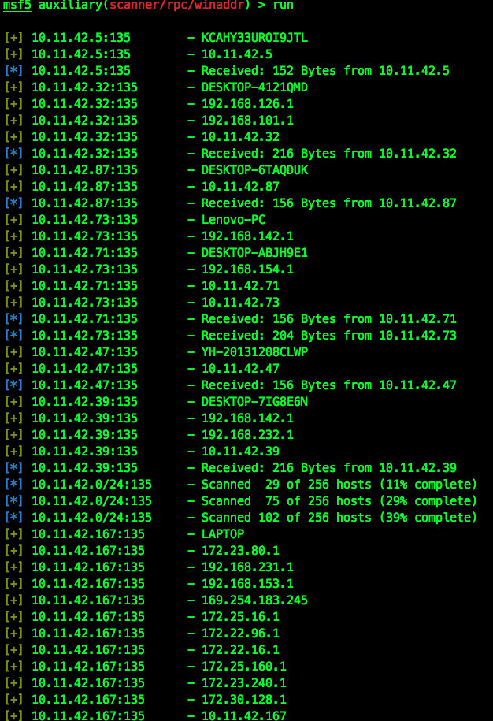
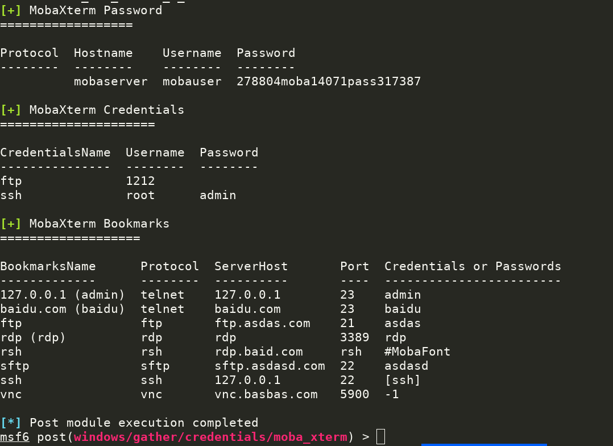

# Metasploit Modules

**郑重声明：文中所涉及的技术、思路和工具仅供以安全为目的的学习交流使用，任何人不得将其用于非法用途以及盈利等目的，否则后果自行承担。**

| 类别 | 说明 |
| ---- | --- |
| 作者 | [AnonySec](https://github.com/An0nysec)、[Rvn0xsy](https://github.com/Rvn0xsy)、[三米前有蕉皮](https://github.com/cn-kali-team) |
| 团队 | [0x727](https://github.com/0x727) 未来一段时间将陆续开源工具 |
| 定位 | Metasploit功能模块开发 |
| 语言 | Ruby |
| 功能 | 支持Metasploit在红队行动中多场景内网横向 |

## 什么是 Metasploit Modules ?

在红队行动中，Metasploit是必不可少的工具，因此根据Metasploit的[官方Wiki](https://github.com/rapid7/metasploit-framework/wiki)、[官方API](https://rapid7.github.io/metasploit-framework/api/)，编写了数个功能模块，基于内网快速横向。

## 为什么选择 Metasploit Modules ?

在红队行动中，本地Metasploit挂代理后，直通目标内网，而载入数个功能模块，更是提高内网横向效率。

## 快速开始体验

#### Git下载安装

```bash
$ git clone https://github.com/0x727/MetasploitModules_0x727.git
```

> 注：使用者本机需要已经安装 Metasploit 工具（[下载安装](https://github.com/rapid7/metasploit-framework/wiki/Nightly-Installers)）

## 使用方法

**在 Metasploit 中会使用如下命令**

- `loadpath 绝对路径/MetasploitModules_0x727` 载入外部模块
- `setg proxies type:host:port[,type:host:port]` 全局代理，内网穿透 (支持代理链)
- `setg ReverseAllowProxy true` 允许反向代理 (通过socks反弹shell，建立双向通道)

```
msf6 > loadpath /Users/username/0x727/Metasploit_0x727
Loaded 12 modules:
    7 post modules
    1 exploit modules
    4 auxiliary modules
msf6 >
```

## Change Log

### mssql_powershell

**2021/03/25** 

[打造定制化的Metasploit—MSSQL重构](https://payloads.cn/2020/0325/create-customized-metasploit%E2%80%94mssql-refactoring.html)

利用Metasploit，通过正确的SQL Server口令信息，可启用`xp_cmdshell`，并获取目标系统`session`。


### clone_user

**2021/03/27** 

[打造定制化的Metasploit—克隆用户](https://payloads.cn/2020/0327/create-customized-metasploitclone-users.html) 

利用已获取`session`，创建登录账户，添加该账户到管理员与远程桌面组，并克隆administrator，从而替代`clone.exe`。

( 支持尝试提权，默认随机8位密码，用户不能设置Guest，应用RID劫持技术)


### unauthorized

**2021/03/31**

[打造定制化的Metasploit—Redis未授权](https://payloads.cn/2020/0331/create-customized-metasploit%E2%80%94unauthorized-by-redis.html) 

批量扫描Redis未授权漏洞，若存在，探测`/root/.ssh/`与`/var/spool/cron/`目录权限，可写入`id_rsa.pub`到目标服务器（`id_rsa.pub`应设置绝对路径），或提示`Cron`反弹命令。


### three

**2021/05/20** 

批量执行三要素：getuid、ipconfig、sysinfo，应对红队场景，并截图当前桌面 (已注释) 。

`sessions -C "run post/windows/three"` 或 `sessions -s "post/windows/three"`


### version_17010

**2021/06/01** 

同一主机，既SMB版本检测也MS17-010 SMB RCE检测。


### eventlog

**2021/06/03** 

[打造定制化的Metasploit—安全日志分析](https://payloads.cn/2020/0703/create-customized-metasploitsecurity-log-analysis.html) 

使用PowerShell分析安全日志中登录成功与失败的事件，并快速提取相关信息。

> 注：gather目录下的`EventLog.ps1`需要放在Metasploit的`/data/post/powershell`下，适用Windows2008以上版本，调用`wevtutil.exe`与`powershell.exe` 。


### collect

**2021/06/15**

[打造定制化的Metasploit—主机信息收集](https://payloads.cn/2020/0718/create-customized-metasploit%E2%80%94host-information-collection.html) 

收集 已安装的应用程序、主机凭据`cmdkey /list && vaultcmd /list`、网络连接`netstat -ano|findstr ESTABLISHED`、Internet Explorer历史记录、Google Chrome历史记录与保存的密码。

批量执行

```sh
msf5 > sessions -C "run post/windows/gather/collect migrate=true"
```

(如是`exploit/windows/smb/psexec`的session，需`set migrate true`，自动注入进程)


### winaddr

**2021/06/16**

[通过OXID解析器获取Windows远程主机上网卡地址](https://payloads.online/archivers/2020-07-16/1)

通过135端口发现主机IP，并识别Windows机器上的所有网卡IP。



### ms17_010_user

**2021/06/28**

通过ms17_010漏洞，添加`admin$`用户于管理员组，并开启远程桌面。(适用 Windows 2003)


### enum_360

**2021/07/15**

获取360安全浏览器保存的登录密码，不支持解密登录了360帐号后的数据库。

> 注：credentials目录下的"sqlite3.dll、remove_password.dll"需要同时放在Metasploit的`/data/post/360/`下，使用解密360浏览器的sqlite密码。


### moba_xterm

**2021/07/18**

对MobaXtrem的保存的密码解密，自动解密主密码。



### ssms

**2021/07/26**

解析Microsoft SQL Server Management Studio管理器的SqlStudio.bin文件，解密获取mssql连接密码。

## 为 Metasploit Modules 做贡献

Metasploit Modules 是一个免费且开源的项目，我们欢迎任何人为其开发和进步贡献力量。

- 在使用过程中出现任何问题，可以通过 issues 来反馈。
- Bug 的修复可以直接提交 Pull Request 到 dev 分支。
- 如果是增加新的功能特性，请先创建一个 issue 并做简单描述以及大致的实现方法，提议被采纳后，就可以创建一个实现新特性的 Pull Request。
- 欢迎对说明文档做出改善，帮助更多的人使用 ，特别是英文文档。
- 贡献代码请提交 PR 至 dev 分支，master 分支仅用于发布稳定可用版本。
- 如果你有任何其他方面的问题或合作，欢迎发送邮件至 0x727Team@gmail.com 。

> 提醒：和项目相关的问题最好在 issues 中反馈，这样方便其他有类似问题的人可以快速查找解决方法，并且也避免了我们重复回答一些问题。

